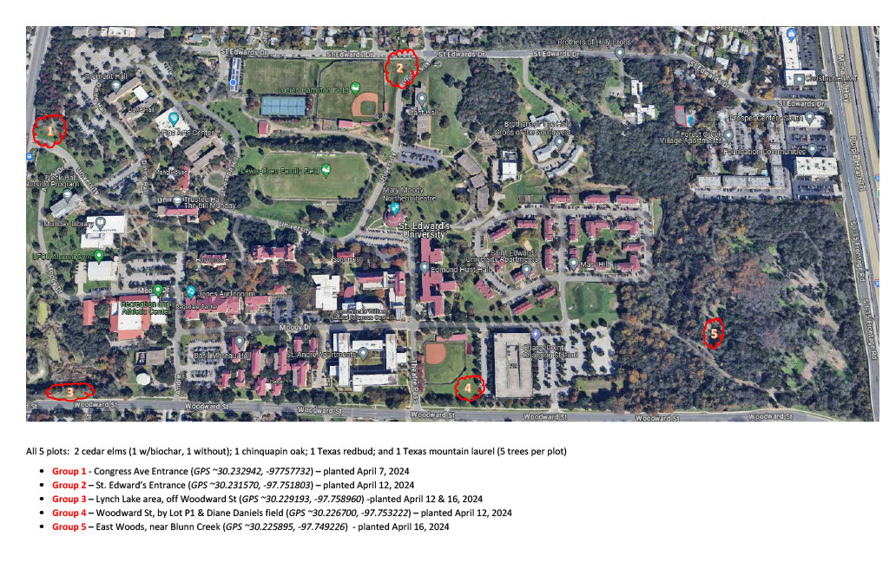
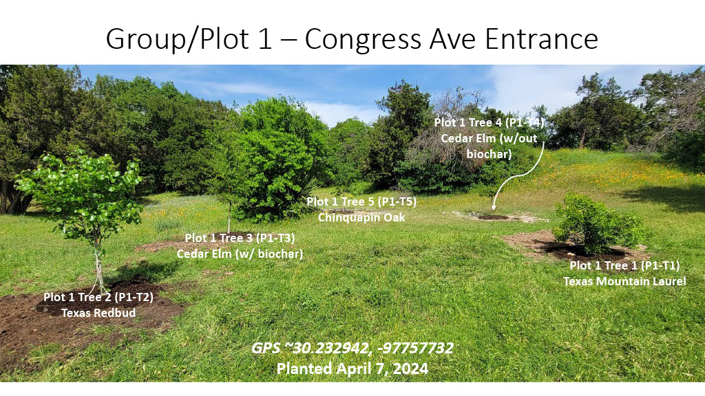
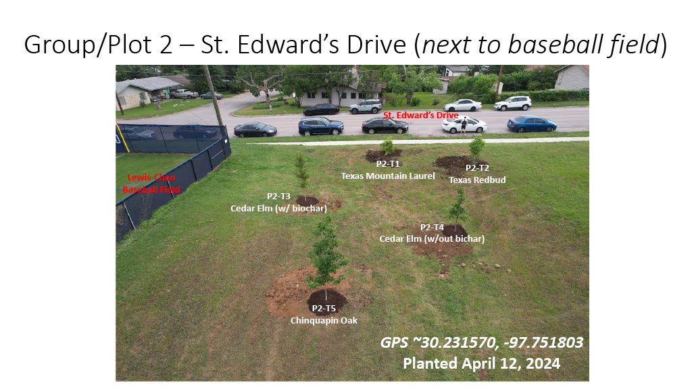
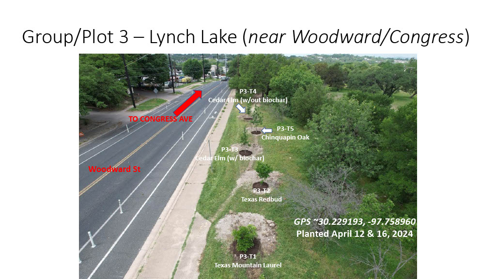
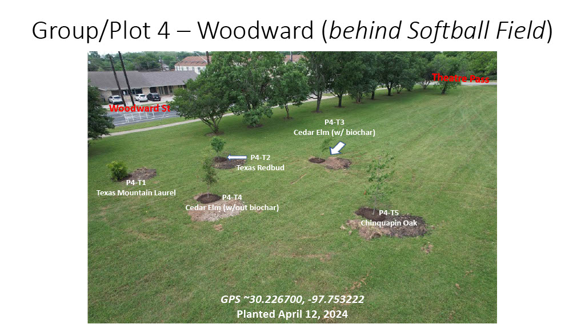
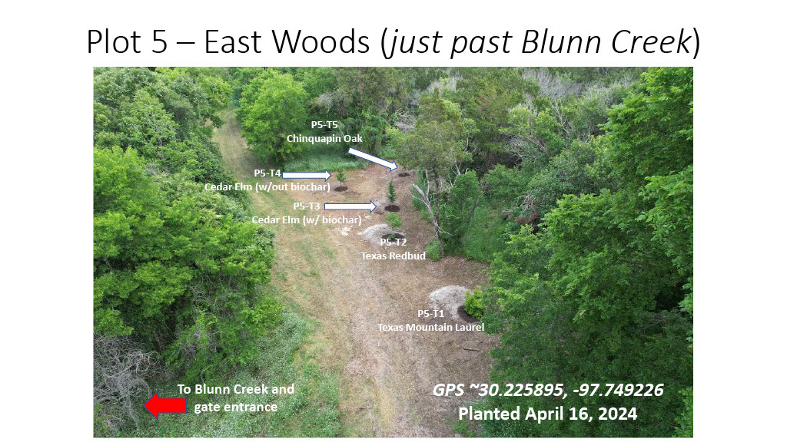

# CliRes Dashboard

**Climate Resilience Tree Health Monitoring** · St. Edward's University

A web-based dashboard for monitoring tree health on the St. Edward's campus. Dendrometer sensors installed on campus trees continuously measure trunk diameter changes at micron-level precision, giving researchers and students insight into tree growth, water uptake, and stress patterns over time.

## Study Site

The trees being monitored are located across the St. Edward's University campus in Austin, Texas.

### Instrumented Plots

| | | |
|:---:|:---:|:---:|
|  |  |  |
|  |  | |

## Features

- **Graphing Tool** — Build custom time-series charts from dendrometer and weather data. Supports line, scatter, and bar plots with configurable aggregation, trendlines, smoothing, and faceted views.
- **AI Growth Prediction** — An XGBoost model trained on historical data predicts how growth responds to temperature, humidity, and dew point. Includes preset scenarios and interactive sliders.
- **Fourier (FFT) Analysis** — Detects repeating cycles in tree growth data to identify daily patterns and distinguish living trees from dead wood based on cycle amplitude.
- **Tree Comfort Index** — Calculates a comfort score from Kestrel field measurements using temperature, humidity, dew point, and VPD.

## Data Sources

| Source | Description |
|--------|-------------|
| ePlant API | Dendrometer sensor readings from campus trees (5-minute intervals) |
| Open-Meteo | Historical weather data (temperature, rainfall) |
| LCRA | Live local weather from the Lower Colorado River Authority |
| Kestrel CSV | Manual field measurements uploaded via CSV |

## Built With

Python, Django, pandas, matplotlib, seaborn, scikit-learn, XGBoost, HTMX, Alpine.js, Tailwind CSS, Bootstrap 5
